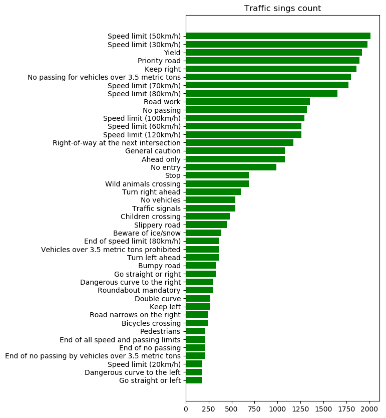
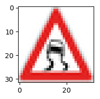
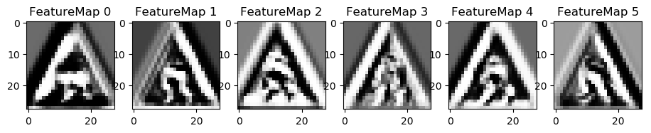

# **Traffic Sign Recognition** 

## Writeup

### You can use this file as a template for your writeup if you want to submit it as a markdown file, but feel free to use some other method and submit a pdf if you prefer.

---

**Build a Traffic Sign Recognition Project**

The goals / steps of this project are the following:
* Load the data set (see below for links to the project data set)
* Explore, summarize and visualize the data set
* Design, train and test a model architecture
* Use the model to make predictions on new images
* Analyze the softmax probabilities of the new images
* Summarize the results with a written report

## Rubric Points
### Here I will consider the [rubric points](https://review.udacity.com/#!/rubrics/481/view) individually and describe how I addressed each point in my implementation.  

---
### Writeup / README

#### 1. Provide a Writeup / README that includes all the rubric points and how you addressed each one. You can submit your writeup as markdown or pdf. You can use this template as a guide for writing the report. The submission includes the project code.

You're reading it! and here is a link to my [project code](https://github.com/GitHK/CarND-Traffic-Sign-Classifier-Project/blob/master/Traffic_Sign_Classifier.ipynb)

### Data Set Summary & Exploration

#### 1. Provide a basic summary of the data set. In the code, the analysis should be done using python, numpy and/or pandas methods rather than hardcoding results manually.

I used the pandas library to calculate summary statistics of the traffic
signs data set:

* The size of training set is ? **34799**
* The size of the validation set is ? **4410**
* The size of test set is ? **12630**
* The shape of a traffic sign image is ? **(32, 32, 3)**
* The number of unique classes/labels in the data set is ? **43**

#### 2. Include an exploratory visualization of the dataset.

The following bar chart shows the distribution fo the classes in the
dataset. Some classes have les then 200 entries and some almost 2000.
The fewer classes there are and the worst the model will behave at
predicting new traffic signs.

This following image is generated picking random images from each class.
Some have better quality while others are barely visible to the human
eye.

### Design and Test a Model Architecture

#### 1. Describe how you preprocessed the image data. What techniques were chosen and why did you choose these techniques? Consider including images showing the output of each preprocessing technique. Pre-processing refers to techniques such as converting to grayscale, normalization, etc. (OPTIONAL: As described in the "Stand Out Suggestions" part of the rubric, if you generated additional data for training, describe why you decided to generate additional data, how you generated the data, and provide example images of the additional data. Then describe the characteristics of the augmented training set like number of images in the set, number of images for each class, etc.)

Data preprocessing was done in three different stages:

- augmentation
- normalization
- grayscaling

**Data augmentation** was done by applying affine transformations:

- rotation (+/- 15 degrees)
- shear +/- 16 pixels
- translation +/- 20% in x and +/15% in y

If an image was augmented, a combination of one or two of thea above was
applied.

There were three different augmentation modes:

- DOUBLE, in which every image was augmented
- SAME_SIZE in which every training class was augmented to almost 2000
    samples
- THRESHOLD in which only classes with less than x images were augmented

The version which behaved best was DOUBLE, providing the batter results.

Training and validation datasets were not mixed together and split for
the purpose of data augmentation. The network best behaved with the
original data (96% validation accuracy), while the augmented version
gave only 94% validation accuracy. The non augmented version fo the data
was chosen in the end.

**Normalization** transformed each image in an equivalent image with
mean 0 and standard deviation 1. It was observed that normalization
provided a huge boost to validation accuracy.

**Grayscaling** each image was transformed in a 3 channel RGB image where
each pixel had the same values for red, green and blue. As with
normalization, grayscaling provided a huge boost to validation accuracy.

#### 2. Describe what your final model architecture looks like including model type, layers, layer sizes, connectivity, etc.) Consider including a diagram and/or table describing the final model.

The final model used is a LeNet with  `tanh` used as non linearity, in
place of the original RELU functions.

The final model consisted of the following layers:

| Layer         		|     Description	        					| 
|:---------------------:|:---------------------------------------------:|
|Layer 1                |Convolutional. Input = 32x32x3. Output = 28x28x6.|
|Activation             |tanh|
|Pooling                |Input = 28x28x6. Output = 14x14x6.|
|Layer 2                |Convolutional. Output = 10x10x16.
|Activation             |tanh|
|Pooling                |Input = 10x10x16. Output = 5x5x16.|
|Flatten                |Input = 5x5x16. Output = 400.|
|Layer 3                |Fully Connected. Input = 400. Output = 120.|
|Activation             |tanh|
|Layer 4                |Fully Connected. Input = 120. Output = 84.|
|Activation             |tanh|
|Layer 5                |Fully Connected. Input = 84. Output = 43.|

#### 3. Describe how you trained your model. The discussion can include the type of optimizer, the batch size, number of epochs and any hyperparameters such as learning rate.

In order to obtain a good result, a series of simulations were
experimented, by combining the following parameters:

- image grayscaling = {True, False}
- image normalization = {True, False}
- image augmentation = {True, False}
- epochs = {10, 20, 50}
- batch size = {128}
- learning rate = {0.001}

Batch size and learning rates where taken from the best matches in the
LeNet laboratory exercise.
I've understood from literature and the community that focusing on the
image preprocessing and with small learning rates would provide the best
results.

The best result was achieved using normalization, grayscaling, no
augmentation, 50 epochs, batch size 128 and learning rate 0.001.

#### 4. Describe the approach taken for finding a solution and getting the validation set accuracy to be at least 0.93. Include in the discussion the results on the training, validation and test sets and where in the code these were calculated. Your approach may have been an iterative process, in which case, outline the steps you took to get to the final solution and why you chose those steps. Perhaps your solution involved an already well known implementation or architecture. In this case, discuss why you think the architecture is suitable for the current problem.

I chose to follow the guidelines in the lessons, and started to search
on the internet about data augmentation, normalization and grayscaling.
I've also read about how to improve the model for traffic sign
recognition.
Even though there are other solutions out there I've chosen to try and
improve the current model in order to better understand how to improve
an existing model.

The best results were obtained when grayscaling and normalization were
introduced and when the activation function was changed to tanh.

The first step was to build a pipeline capable of computing all the
permutations of some selected parameters. As soon as I've found the
 best results, I've focused my attention to the dataset and finally to
 the network.
With just a few changes to the data and to the activation function a
good result was obtained.

What could be done to better to improve the accuracy and final test set
result is to merge training and validation sets, augment them, split the
data into new training and validation sets and retrain the network.

My final model results were:

* training set accuracy of 1.0000
* validation set accuracy of 0.9678
* test set accuracy of 0.9416

The listed results may be found at cell `In [67]`

If an iterative approach was chosen:
* What was the first architecture that was tried and why was it chosen?

LeNet was chosen in order to better understand how to boost an existing's
network accuracy.

* What were some problems with the initial architecture?

Training accuracy was very low.

* How was the architecture adjusted and why was it adjusted? Typical adjustments could include choosing a different model architecture, adding or taking away layers (pooling, dropout, convolution, etc), using an activation function or changing the activation function. One common justification for adjusting an architecture would be due to overfitting or underfitting. A high accuracy on the training set but low accuracy on the validation set indicates over fitting; a low accuracy on both sets indicates under fitting.

By changing the activation function to a more adequate one for image
classification, like tanh. A huge boost was obtained, almost 4 percentage
points.

* Which parameters were tuned? How were they adjusted and why?

The main tuned parameters were, learning rate and epochs which provided
the first tangible improvements. After the validation accuracy stopped
 improving, I've turned my attention to the input data.
Both grayscaling and normalization got a good increment to validation
 accuracy, but using them together yielded the best results.

* What are some of the important design choices and why were they chosen? For example, why might a convolution layer work well with this problem? How might a dropout layer help with creating a successful model?

In its current implementation, the network tends to overfit, it is most
obvious with very few data. The network could be improved by using other
pooling layers and also by adding more data and by recreating the validation
set with augmented data. All operations which tend to introduce new data
and create small "errors" (perturbations) tend to strengthen the
network and provide better overall results.
 

### Test a Model on New Images

#### 1. Choose five German traffic signs found on the web and provide them in the report. For each image, discuss what quality or qualities might be difficult to classify.

Here are eight German traffic signs that I found on the web.

    0 - Speed limit (20km/h)

There should be no issues with classifying this sign.

    11 - Right-of-way at the next intersection

I'd expect to have some incertenty, due to the angle from which the
photo was taken.

    13 - Yield

This should be an easy sign to detect and classify. There could be some
interference due to the great amount of sky and clouds near by.

    14 - Stop

Stop is an unique sign, the network should perform good.

    22 - Bumpy road

I'd expect to have some issues with classifying this sign.

    22 - Bumpy road2

(introduced to understand if the network can classify it)

    23 - Slippery road

I'd expect the network to have issues classifying it.

    23 - Slippery road2

(introduced to understand if the network can classify it)

I assumed all the signs picked could yield a good result, except for the
first Bumpy road sign.
The second `bumpy road` and slippery road` signs were introduced later
 to verify if the model could work correctly.

#### 2. Discuss the model's predictions on these new traffic signs and compare the results to predicting on the test set. At a minimum, discuss what the predictions were, the accuracy on these new predictions, and compare the accuracy to the accuracy on the test set (OPTIONAL: Discuss the results in more detail as described in the "Stand Out Suggestions" part of the rubric).

Here are the results of the prediction:

| Image			        |     Prediction	        					| 
|:---------------------:|:---------------------------------------------:|
|Speed limit (20km/h) | Roundabout mandatory|
|Right-of-way at the next intersection|Right-of-way at the next intersection|
|Yield|Yield|
|Stop|Stop|
|Bumpy road|Turn left ahead
|Bumpy road2|Bumpy road|
|Slippery road|Children crossing|
|Slippery road2|Slippery road|

Initially the model was able to predict **3/5** signs with an accuracy of **60%**.

After the introduction of the second version for the `Slippery road` and
the `Bumpy road` it was possible ot obtain a higher accuracy.

The network gave pour results at classifying `Slippery road` signs.
The only one which it manged to classify, was one with a white background,
such picture cannot be found in real life situations.

#### 3. Describe how certain the model is when predicting on each of the five new images by looking at the softmax probabilities for each prediction. Provide the top 5 softmax probabilities for each image along with the sign type of each probability. (OPTIONAL: as described in the "Stand Out Suggestions" part of the rubric, visualizations can also be provided such as bar charts)

The code for making predictions on my final model is located in the
`In [71]` cell of the Ipython notebook.

    0 - Speed limit (20km/h)
    [||||||||||||||||||||||||||||||||||||||| ] 0.9818 ->  1 - Speed limit (30km/h)
    [                                        ] 0.0110 -> 18 - General caution
    [                                        ] 0.0049 ->  0 - Speed limit (20km/h)
    [                                        ] 0.0008 -> 29 - Bicycles crossing
    [                                        ] 0.0006 -> 24 - Road narrows on the right

I would expect that this traffic sign could be correctly predicted, but
due to the low amount of entries in training dataset, the result is to be
expected. It came really close, by choosing a sign with similar features.

    11 - Right-of-way at the next intersection
    [||||||||||||||||||||||||||||||||||||||| ] 1.0000 -> 11 - Right-of-way at the next intersection
    [                                        ] 0.0000 -> 28 - Children crossing
    [                                        ] 0.0000 -> 30 - Beware of ice/snow
    [                                        ] 0.0000 -> 34 - Turn left ahead
    [                                        ] 0.0000 -> 27 - Pedestrians

100% accuracy, I'd guess the triangle shape with th crossing roads and
the big training set at the disposal of the model made the difference.

    13 - Yield
    [||||||||||||||||||||||||||||||||||||||| ] 1.0000 -> 13 - Yield
    [                                        ] 0.0000 ->  8 - Speed limit (120km/h)
    [                                        ] 0.0000 -> 33 - Turn right ahead
    [                                        ] 0.0000 -> 28 - Children crossing
    [                                        ] 0.0000 ->  9 - No passing

Almost certain, being designed to be unique a yield sign should be easy
to predict, also there are a lot of training images of yield signs.

    14 - Stop
    [||||||||||||||||||||||||||||||||||||||| ] 0.9864 -> 14 - Stop
    [                                        ] 0.0087 ->  1 - Speed limit (30km/h)
    [                                        ] 0.0046 ->  4 - Speed limit (70km/h)
    [                                        ] 0.0001 ->  2 - Speed limit (50km/h)
    [                                        ] 0.0001 -> 18 - General caution

The stop sign is has also got a particular shape which is easy to
predict, being unique in the entire dataset. It does not have so many
samples to train on, but its features make it easy to classify.

    22 - Bumpy road
    [|||||||||||||||||||||||||||||||||       ] 0.8398 -> 34 - Turn left ahead
    [|||||                                   ] 0.1339 -> 28 - Children crossing
    [                                        ] 0.0127 -> 30 - Beware of ice/snow
    [                                        ] 0.0034 -> 12 - Priority road
    [                                        ] 0.0029 -> 38 - Keep right

The model had no idea what it was looking at, due to low samples in the
training dataset. The model managed to predict classes from danger signs,
which makes sense, because features are in common with other danger signs.

    22 - Bumpy road2
    [||||||||||||||||||||                    ] 0.5058 -> 22 - Bumpy road
    [|||||||||||||||||                       ] 0.4431 -> 26 - Traffic signals
    [|                                       ] 0.0372 -> 20 - Dangerous curve to the right
    [                                        ] 0.0081 -> 24 - Road narrows on the right
    [                                        ] 0.0020 -> 30 - Beware of ice/snow

With an image closer to the reality, it managed to somehow find a
prediction, but the accuracy is pretty low. The training dataset does not
contain so many images for this class.

    23 - Slippery road
    [||||||||||||||||||||||||||||            ] 0.7203 -> 28 - Children crossing
    [|||||||                                 ] 0.1865 -> 23 - Slippery road
    [|                                       ] 0.0394 -> 11 - Right-of-way at the next intersection
    [|                                       ] 0.0302 -> 30 - Beware of ice/snow
    [                                        ] 0.0096 -> 24 - Road narrows on the right

It seems that the slippery road in the sign summed to the the angle at
which the sign is tilted, made it so that it would appear as children
crossing sign (at leas most of the features). The second guess is the
correct prediction.

    23 - Slippery road2
    [||||||||||||||||||||||||||||||||||      ] 0.8659 -> 23 - Slippery road
    [||||                                    ] 0.1040 -> 30 - Beware of ice/snow
    [                                        ] 0.0075 -> 28 - Children crossing
    [                                        ] 0.0056 -> 19 - Dangerous curve to the left
    [                                        ] 0.0052 -> 25 - Road work

With the sign has almost no noise, it managed to produce match.
Due to low training dataset the accuracy is still not optimal.

### (Optional) Visualizing the Neural Network (See Step 4 of the Ipython notebook for more details)
#### 1. Discuss the visual output of your trained network's feature maps. What characteristics did the neural network use to make classifications?

The main characteristics used to classify the traffic signs was shape,
followed by the shades. In the last layer **Tanh_1:0** it is still visible
that certain characteristics are selected from the original shape.
The first layers manage to pickup on basic features like shape and shadows,
the last layer seems to understand the direction in which shapes are
oriented.

    Tensor 'Tanh:0', shape '(1, 28, 28, 6)

    Tensor 'MaxPool:0', shape '(1, 14, 14, 6)

    Tensor 'Tanh_1:0', shape '(1, 10, 10, 16)

    Tensor 'Tanh:0', shape '(1, 28, 28, 6)

    Tensor 'MaxPool:0', shape '(1, 14, 14, 6)

    Tensor 'Tanh_1:0', shape '(1, 10, 10, 16)

    Tensor 'Tanh:0', shape '(1, 28, 28, 6)

    Tensor 'MaxPool:0', shape '(1, 14, 14, 6)

    Tensor 'Tanh_1:0', shape '(1, 10, 10, 16)

    Tensor 'Tanh:0', shape '(1, 28, 28, 6)

    Tensor 'MaxPool:0', shape '(1, 14, 14, 6)

    Tensor 'Tanh_1:0', shape '(1, 10, 10, 16)

    Tensor 'Tanh:0', shape '(1, 28, 28, 6)

    Tensor 'MaxPool:0', shape '(1, 14, 14, 6)

    Tensor 'Tanh_1:0', shape '(1, 10, 10, 16)

    Tensor 'Tanh:0', shape '(1, 28, 28, 6)

    Tensor 'MaxPool:0', shape '(1, 14, 14, 6)

    Tensor 'Tanh_1:0', shape '(1, 10, 10, 16)

    Tensor 'Tanh:0', shape '(1, 28, 28, 6)

    Tensor 'MaxPool:0', shape '(1, 14, 14, 6)

    Tensor 'Tanh_1:0', shape '(1, 10, 10, 16)

    Tensor 'Tanh:0', shape '(1, 28, 28, 6)

    Tensor 'MaxPool:0', shape '(1, 14, 14, 6)

    Tensor 'Tanh_1:0', shape '(1, 10, 10, 16)

